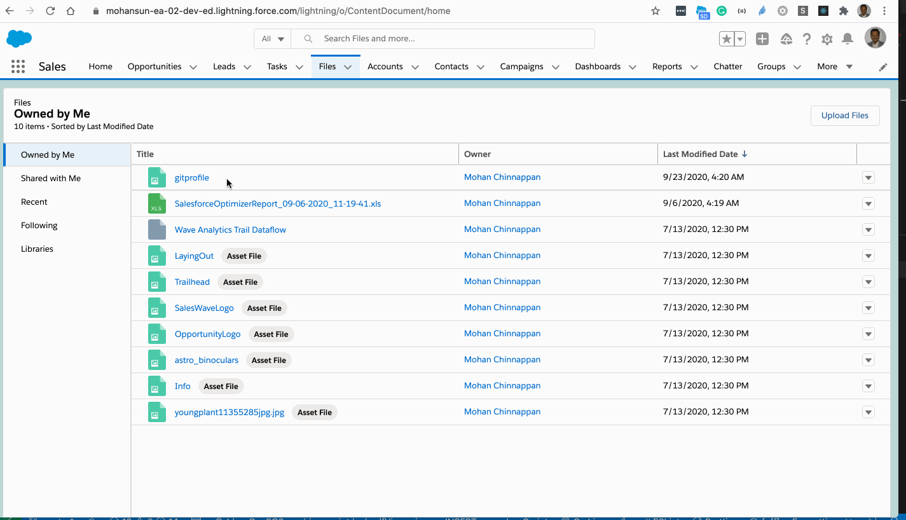

# LWC - Component to display PDF documents

## Topics
- [Setup](#setup)
- [Using the PDFViewer Component](#using)

<a name='setup'></a>
## Setup


## Upload files

- Go to content home ```(instance_url/lightning/o/ContentDocument/home)``` and upload the PDF document
- Get the Id of the PDF document  (example: 0693h000007CVFZAA4)

### Demo



### Example urls
- [Content Home](https://mohansun-ea-02-dev-ed.lightning.force.com/lightning/o/ContentDocument/home)
- [View Link](https://mohansun-ea-02-dev-ed.lightning.force.com/lightning/r/ContentDocument/0693h000007CVFZAA4/view)
- [Download Link](https://mohansun-ea-02-dev-ed--c.documentforce.com/sfc/servlet.shepherd/document/download/0693h000007CVFZAA4)

<a name="using"></a>
##  Using the PDFViewer Component 
### Demo


